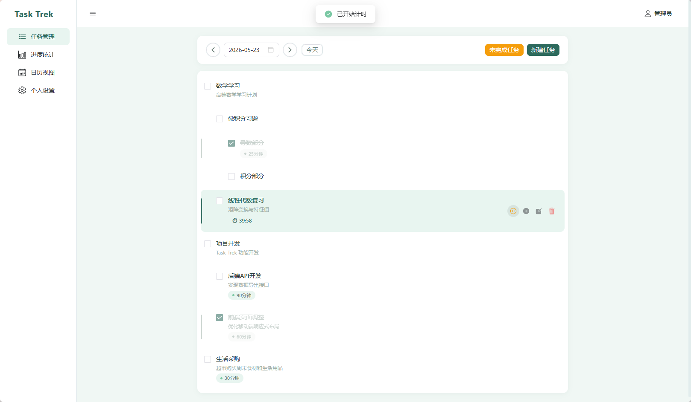

# Task-Trek

轻量级任务规划工具，支持三层级任务管理、打卡系统、进度统计、日历视图和白噪音专注模式。

## 技术栈

| 层 | 技术 |
|---|------|
| 前端 | Vue 3 + Vite + TypeScript + Naive UI + Pinia + Vue Router |
| 后端 | Nest.js + Express + TypeORM + SQLite + JWT |
| 图表 | ECharts |
| 图标 | @vicons/ionicons5 |
| 状态管理 | Pinia (user store, whiteNoise store) |

## 功能

- 三层级任务（一级/二级/三级）管理，树形结构展示
- 子任务级联创建，父任务耗时自动清零
- 打卡/取消打卡，父子任务级联操作
- 任务倒计时专注模式（每秒同步到数据库）
- 白噪音播放（海浪、篝火、雨声、溪水、夜晚、轻松、助眠、钢琴）
- 进度统计概览、完成趋势、未完成任务清单
- 日历视图，点击日期跳转任务管理
- Markdown 导入/导出
- 用户注册/登录，数据按用户隔离
- 薄荷绿主题设计系统

## 界面预览



## 快速开始

### 1. 启动后端

```bash
cd backend
npm install
npm run start:dev
```

后端运行在 http://localhost:3000

### 2. 启动前端

```bash
cd frontend
npm install
npm run dev
```

前端运行在 http://localhost:5173

### 3. 默认账户

- 用户名：`admin`
- 密码：`123456`

## 开发命令

### 后端

| 命令 | 说明 |
|------|------|
| `npm run start:dev` | 开发模式（热重载） |
| `npm run build` | 构建 |
| `npm run start:prod` | 生产模式 |
| `npm run test:e2e` | 端到端测试 |

### 前端

| 命令 | 说明 |
|------|------|
| `npm run dev` | 开发模式 |
| `npm run build` | 生产构建 |
| `npm run preview` | 预览构建结果 |

## 业务规则

- 新建任务默认一级，通过行内按钮创建子任务
- 一级可创建二级，二级可创建三级，三级不可再创建
- 有子任务的父任务预计耗时自动清零
- 统计只计算有预计耗时的叶子节点任务
- 删除任务级联删除所有后代任务及打卡记录
- 打卡/取消打卡在父子任务间级联
- 白噪音设置按用户持久化，页面刷新自动恢复
- 任务倒计时每秒同步到数据库，本地倒计时独立运行

## 设计系统

### 配色方案（薄荷主题）

| 用途 | 颜色 |
|------|------|
| 主色 | `#2D6A5D` |
| 主色 Hover | `#245a4e` |
| 背景 | `#F0F7F4` |
| 强调色 | `#7BC8A4` |
| 文字主色 | `#2C3E3A` |
| 文字次要 | `#6B7F77` |
| 成功 | `#7BC8A4` |
| 警告 | `#F59E0B` |
| 错误 | `#EF4444` |

### 圆角规范

| 组件 | 圆角 |
|------|------|
| 按钮 | 8px |
| 卡片 | 12px |
| 标签 | 20px |
| 输入框 | 8px |

## 数据库

SQLite 文件位于 `backend/data/app.db`，TypeORM 自动建表。

### 数据表

| 表名 | 说明 |
|------|------|
| `users` | 用户信息（含白噪音设置） |
| `tasks` | 任务（三级树形结构） |
| `checkins` | 打卡记录 |

### 索引

- `idx_tasks_user_date`
- `idx_tasks_user_status`
- `idx_tasks_user_parent`